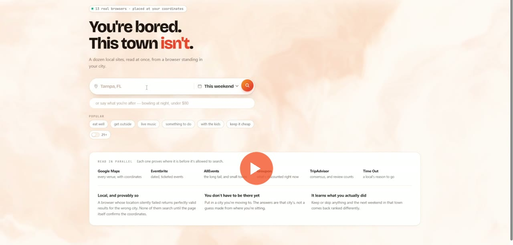

# Sidequest

Say where you are and what you feel like. It launches thirteen browsers in the
cloud, stands every one of them at your coordinates, reads Google Maps,
Eventbrite, AllEvents, Groupon, TripAdvisor and Time Out at the same time, and
hands back a Saturday and a Sunday you can actually follow — with a line of
page text behind every stop and a replay of the browser that found it.

Built on [Solari](https://getsolari.com) cloud browsers, on a fork of their
[cookbook](https://github.com/solari-sdk/solari-cookbook).

**The problem.** What is on this weekend is split across a dozen sites and not
one of them will sell you an API. Every attempt to unify local listings has
died on exactly that — you would have to convince every platform to cooperate,
and they have no reason to. Worse, the answers are local in a way an ordinary
request cannot reach: the web personalises on where your traffic comes from and
what you have clicked before, so somebody who has just moved keeps being shown
their old life.

[](sidequest/docs/demo.mp4)

**[▶ Watch the run (1 min)](sidequest/docs/demo.mp4)** — Tampa, this weekend,
typed from cold. Thirteen browsers up, 113 places read, a plan in about twenty
seconds.

Nothing in the recording is staged and the parts that went badly are still in
it. Venues appear as each browser reads them rather than when the slowest one
finishes, which is why the list fills in while you watch. Two sources came back
with nothing and the header says so — **"4 sources still reading…"**, then a
final count that does not pretend to be six. That matters more than it looks: a
weekend planner that quietly drops the source that refused it is not telling
you what is on, it is telling you what it *managed to read*, and it never says
which part it missed.

## What it found

The interesting results are the ones that came back the wrong way round.

| What we found | The number, and what it cost us to believe it |
|---|---|
| **Where the browser stands decides the whole answer** | `npm run geo-proof` asks *"live music"* from Tampa and Seattle in the same second, from the same residential pool. **0% overlap** — 1920 Ybor and The Sapphire against Neumos and The Crocodile. Not a ranking difference; a different city's worth of results. |
| **The proxy is not what localises you** | The residential tunnel died mid-build, every lane returning `ERR_TUNNEL_CONNECTION_FAILED`. The **geolocation override** is what puts a browser in a city, so a failed tunnel now falls back to direct egress and the plan still comes back. What you lose is the sources that block datacentre traffic. |
| **One browser per keyword beat every other optimisation** | Google Maps looped its search terms inside a single browser, so the fan-out's wall clock was its keyword count times a navigation. Sharding it: **92.8s → 22.2s, and 29 candidates → 106**, on the identical query. |
| **You cannot honestly price a weekend** | Maps publishes a price on **22 of 469** stored candidates — 5%. Groupon manages 87%, because there the price *is* the product. So there is no weekend total anywhere in this product: a figure built from two knowns and four unknowns reads as *the cost of the weekend* whatever caveat sits beside it. |
| **The site already says what a place is, and we were throwing it away** | Maps prints its own type on **44 of 48** results. We were parsing it, flattening it to one of eleven categories and discarding the words — then spending days re-deriving from names what the page said in plain English. Reading it fixed four bugs at once, including a bowling *supply* shop scheduled as an afternoon out. |
| **Partial results are the normal case, not the failure case** | Any one source can hang for ninety seconds. On a measured run **three of six missed the 20-second deadline** and landed just after it. The deadline cancels the stragglers rather than waiting, and the page reports the count it actually got. |

Three of those are negative results. They are here because the alternative —
reporting only the findings you hoped for — is how you end up with a demo that
works exactly once.

## Run it

```bash
cd sidequest
npm install
cp .env.example .env      # paste your slr_live_ key in

npm run dashboard         # -> http://localhost:5173
```

Type a city and search, or say what you are after in your own words —
*"bowling at night"*, *"live music, under $80"*. About twenty seconds.

Measured, on towns of very different thickness:

```
Tampa, FL        17.3s   161 listings   6/6 sources   127 admitted
Asheville, NC    20.1s   133 listings   5/6 sources   108 admitted
Palm Coast, FL   20.1s   124 listings   5/6 sources    57 admitted
                         the same work, one at a time: ~70s
```

There is a CLI that does the whole thing without the browser UI, and an
`--explain` flag that prints the arithmetic behind every choice:

```bash
npm run plan -- "Tampa, FL" -- --ask "bowling at night" --explain
npm run geo-proof         # the two-city diff above, live
npm test                  # 268 tests, no network, ~1s
```

It runs locally on your own key. One plan is about thirteen browser-minutes, so
a search button open to the internet would spend metered credit on strangers'
behalf — which the recording above demonstrates for nothing.

## Where Solari is used

Every venue on the screen was read by a real Chromium in Solari's cloud. There
is no scraping library here and no HTTP client pretending to be a browser — six
of these sources publish no usable API, so a browser is not a shortcut, it is
the only door.

In the recording, "13 browsers" is thirteen cloud sessions launched at once:
one per source, and one per search term for Google Maps, which is the only
source that lists ordinary local businesses rather than ticketed events.

| Where | The call | Why it has to be a cloud browser |
|---|---|---|
| **Every listing read** | `solari.launch({ stealth: true })`, then ordinary patchright | No API exists. Five of the six serve a different page, or none, to obvious automation. |
| **Standing in the city** | `newContext({ geolocation, timezoneId, locale })` | This is what localises the browser, not the proxy. It is also why you can plan a weekend in a city you have not moved to yet. |
| **Proving it stood there** | the page's own `navigator.geolocation`, read back | No source may search until the page it opened confirms the coordinates. A browser whose location silently failed returns perfectly valid results for the wrong city — the one failure that looks exactly like success. |
| **Thirteen at once** | many `launch()` calls in parallel, one per shard | Twenty seconds instead of seventy. This one is the product, not an optimisation. |
| **Watching it get found** | `recording` → rrweb replay per session | Every recommendation has a *watch it get found* button. Provenance you can click, rather than a claim. |
| **Getting through walls** | `proxy` residential, `captcha` | Only some sources need it, and what happens when the tunnel dies is in the table above. |

Deliberately **not** used: sandboxes, desktops, profiles. This is a
read-the-page problem, not a run-code or drive-a-GUI one, and reaching for them
to touch more of the SDK would be padding.

## What we would still want

**Small-town coverage at volume.** The gate rejects hard on purpose, and in a
thin town that shows: Palm Coast admits 57 of 124 where Tampa admits 127 of
161. That is the honest number rather than a padded plan, but establishing
*which* categories thin out, and where, would take hundreds of towns — which is
thousands of browsers.

**Reddit without an account.** `r/<city>` is the best local signal there is, and
Reddit blocks automated reads: measured across residential, datacentre, stealth,
captcha and bot-auth, 403 every time. It runs on the official API token instead
and skips itself when there is no key. Automating a logged-in personal account
would violate their terms and risk the account, so it is not done.

### Where an agent would go

There is no LLM anywhere in the decision path. Screening, ranking, scheduling
and learning are ordinary functions with named score components, and the same
sentence gives the same plan every time. That is a tested choice rather than an
omission — an early version asked a model to read *when* a request wanted
something, and it answered `"evening"` on one run and nothing on the next, from
the identical sentence.

At a hundred cities, two seams start to hurt, and both are visible in the code
already:

**Nothing knows what a listing *is*.** It knows what a search returned and what
the page said. Most of that gap closed by reading the descriptor Maps already
publishes — but one case cannot be fixed with a pattern at all. Pin Chasers is a
Tampa bowling alley, found by the search for *bowling* and by the search for
*arcades*; each keyword has its own browser, they merge in whatever order they
finish, and that day the arcade one won. The alley came back typed `Video
arcade` and lost the evening that had been booked for it. No vocabulary catches
that, because the vocabulary was right both times.

**The selection is greedy.** Fine for six slots out of a hundred candidates, and
visibly not a model of taste. *"A rainy Sunday with a seven-year-old and $60
left"* is a judgement.

The shape that keeps both honest is **the model labels, the code decides**: one
batched call attaching facts to candidates, cached against the candidate id the
store already keys on, so a venue is labelled once ever and the same sentence
still gives the same plan. Not built, deliberately — at this size the
deterministic version is more inspectable, cheaper, and better to demo.

## What is in here

```
sidequest/
  src/pipeline.ts          the plan, as events — the CLI and the web UI share it
  src/solari/pool.ts       sharded fan-out, live-session tracking, global deadline
  src/solari/geo.ts        the geolocation gate: nothing searches until the page agrees
  src/engine/relevance.ts  one admission gate: place, time, kind, age
  src/engine/score.ts      deterministic ranking with named components
  src/engine/itinerary.ts  a ranked list -> an actual schedule
  src/engine/keywords.ts   what to search for, decided before any browser opens
  src/engine/learn.ts      thumbs -> a taste vector
  src/sources/*.ts         six readers, one Candidate shape
  src/web/                 node:http + SSE, and one page of vanilla JS
  probe.mjs                drives the real page in a real browser
```

The **[full write-up](sidequest/README.md)** is worth more than this page: the
measured dead ends, six gotchas that each cost an afternoon, and the reasoning
behind every rule in the gate.

A taste of it — each of these shipped, and none of them raised anything:

- `waitForSelector` with a 6-second timeout took **65 seconds** on a busy SPA.
  Its polling cannot get scheduled on a saturated page.
- Event dates were scraped, displayed, and then thrown away. Across 206 stored
  listings, **83 were on a different date** than the weekend they appeared in.
- `Number("")` is `0`, not `NaN`. An absent query parameter became zero, so a
  thirteen-browser fan-out ran single file until the deadline killed it.
- A deadline that cancels nothing is not a deadline: the run returned at 20s and
  then blocked for another 50 while abandoned browsers finished navigating.

## The Solari examples this is built on

The upstream cookbook is still here in [`examples/`](examples) — small, runnable
programs for cloud browsers, sandboxes and desktops. The ones this project leans
on:

| Example | What it shows |
| --- | --- |
| [browser-quickstart-ts](examples/browser-quickstart-ts) | Launch a browser, open a page, read it |
| [browser-stealth-proxy-ts](examples/browser-stealth-proxy-ts) | Stealth mode + residential proxy egress |
| [browser-session-recording-py](examples/browser-session-recording-py) | Record a session, download the replay |

Two gotchas this project paid for, on top of the ones upstream documents:

- **The proxy is not the localiser.** When every tunnel fails at once it looks
  like your geo targeting has broken. It has not — the geolocation override is
  doing that work, and a browser on direct egress is still standing in the right
  city.
- **A deadline has to close sessions, not just stop awaiting them.** Tracking
  live sessions and closing them when the clock fires is the difference between
  a 20-second run and a 70-second one that reports 20.

## A note on what this is

Listings are read from each site's own public pages, at the rate a person might
plausibly browse them. It answers the question you would have answered by hand
with a dozen tabs, faster. It sells nothing, takes no commission, and touches
nobody's account — every recommendation carries the line of text it came from
and the session that read it, and you go to the venue's own page to book.

Reddit is the one source that says no to automation, so it is used through the
official API or not at all.

- Solari — [docs](https://docs.getsolari.com) ·
  [console](https://console.getsolari.com)
- Upstream cookbook —
  [solari-sdk/solari-cookbook](https://github.com/solari-sdk/solari-cookbook)
