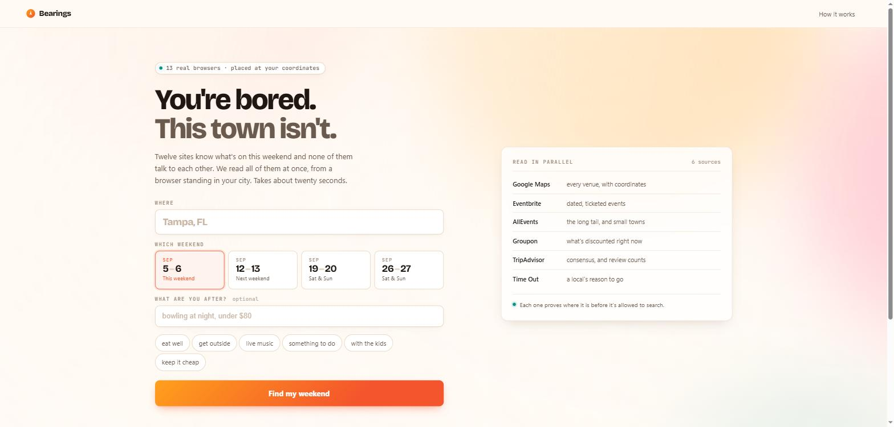
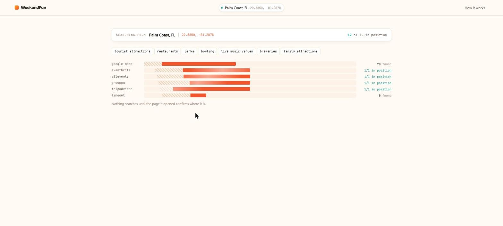
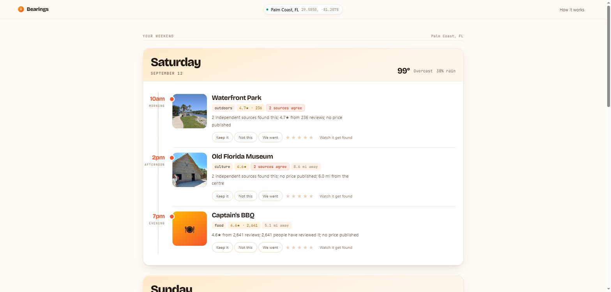

# Sidequest

**You're bored. This town isn't.**

*It's the weekend, you're new here, and you have no idea what's on.*

What's on near you is split across a dozen sites and not one of them will sell you an API. Every attempt to unify local listings has died on exactly that — you'd have to convince every platform to cooperate.

So this doesn't ask. It opens real browsers in the cloud, stands them at your coordinates, and reads all of them at the same time. A browser is a permissionless interface: if a site has a page, it can be read.

A fork of the [Solari cookbook](https://github.com/solari-sdk/solari-cookbook) with a real application on top, built on [Solari](https://getsolari.com).

### → [**`sidequest/`**](sidequest) — the project, and the full write-up

```bash
cd sidequest
npm install
cp .env.example .env      # add your SOLARI_API_KEY
npm run dashboard         # http://localhost:5173
```



## Thirteen browsers, all standing in your city



One browser per source — and for Google Maps, one browser per search term. The Starter plan allows twenty concurrent browsers; this uses thirteen and finishes in the time the slowest one takes, with a hard 20-second deadline and partial results treated as normal.

Same Palm Coast query, before and after that change:

```
92.8s   29 candidates   1/6 sources   place: 0 confirmed / 35 unknown
22.2s  106 candidates   5/6 sources   place: 51 confirmed / 31 unknown
```

## Then a plan, and everything else it found



## Why it needs a cloud browser

**You have to be standing there.** The web personalises on where your traffic comes from and what you've clicked before — and someone new to a town has the wrong IP history and no click history, so the internet keeps showing them their old life. `npm run geo-proof` asks *"live music"* from two cities simultaneously and diffs the answers:

| Tampa browser | Seattle browser |
|---|---|
| 1920 Ybor | Neumos |
| The Sapphire Tampa | The Crocodile |
| Chewy's Lounge | Dimitriou's Jazz Alley |

**0% overlap** — from the same residential IP pool.

**And you don't have to be there yet.** Put a city you're moving to in the box and the answers are that city's, not a guess made from here. Nothing without a browser you can place somewhere can do that.

Three more things make it a planner rather than a scraper:

- **Corroboration.** Independent sources agreeing on a venue means more than any one ranking it first — and it's the signal only a parallel fan-out can compute.
- **An admission gate.** Every candidate from every source is asked whether it's near this city, on these days, and a thing you'd actually go and do. "Unknown" is its own state and it gets counted, because 70% of listings publish no location at all and pretending otherwise is how bad results got in.
- **It learns.** Rate a plan; the next one is different. Deterministic, inspectable, and it works with the LLM switched off.

Full details, the measured dead ends, and six gotchas that each cost an afternoon: **[sidequest/README.md](sidequest/README.md)**.

---

## The upstream cookbook

The original Solari examples are unchanged in [`examples/`](examples) — short, runnable, one idea each.

| Cloud browser | | Sandbox | | Desktop | |
| --- | --- | --- | --- | --- | --- |
| [browser-quickstart-ts](examples/browser-quickstart-ts) | TS | [sandbox-quickstart-ts](examples/sandbox-quickstart-ts) | TS | [desktop-computer-use-py](examples/desktop-computer-use-py) | Py |
| [browser-quickstart-py](examples/browser-quickstart-py) | Py | [sandbox-code-interpreter-py](examples/sandbox-code-interpreter-py) | Py | | |
| [browser-stealth-proxy-ts](examples/browser-stealth-proxy-ts) | TS | [sandbox-port-preview-ts](examples/sandbox-port-preview-ts) | TS | | |
| [browser-profiles-ts](examples/browser-profiles-ts) | TS | | | | |
| [browser-session-recording-py](examples/browser-session-recording-py) | Py | | | | |

```bash
cd examples/browser-quickstart-ts
npm install
export SOLARI_API_KEY=slr_live_...
npm start
```

One `slr_live_` key works across browsers, sandboxes and desktops.

- Docs — [docs.getsolari.com](https://docs.getsolari.com)
- Console — [console.getsolari.com](https://console.getsolari.com)

MIT licensed.
