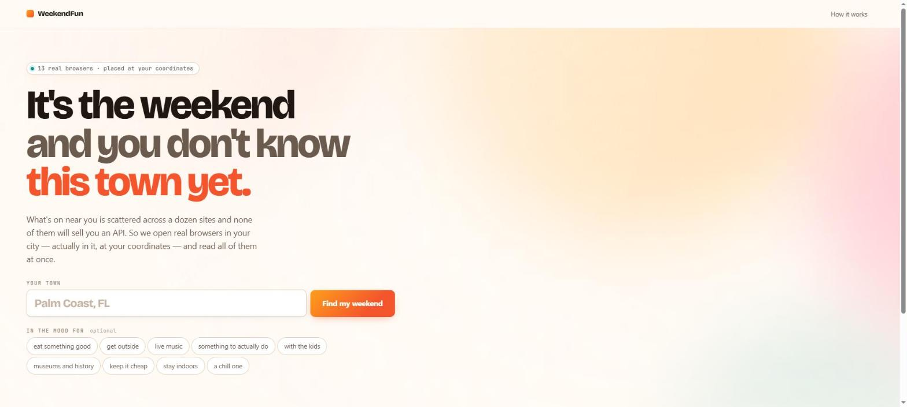
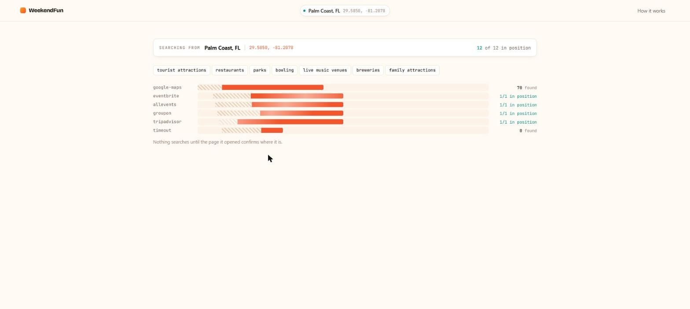

# WeekendFun

**It's the weekend and you don't know this town yet.**

What's on near you is split across a dozen sites and not one of them will sell
you an API. Every attempt to unify local listings has died on exactly that —
you'd have to convince every platform to cooperate.

So this doesn't ask. It opens real browsers in the cloud, stands them at your
coordinates, and reads all of them at the same time. A browser is a
permissionless interface: if a site has a page, it can be read.

Built on [Solari](https://getsolari.com).

```bash
npm install
cp .env.example .env      # add your SOLARI_API_KEY
npm run dashboard         # http://localhost:5173
```



## Why a cloud browser is load-bearing here

Three things, and none of them are "scraping is convenient".

**You have to be standing there.** The web personalises on where your traffic
comes from and what you've clicked before. Someone who just moved has the wrong
IP history and no click history, so the internet keeps showing them their old
life. `npm run geo-proof` asks *"live music"* from two cities at the same
moment and diffs the answers:

| Tampa browser | Seattle browser |
|---|---|
| 1920 Ybor | Neumos |
| The Sapphire Tampa | The Crocodile |
| Chewy's Lounge | Dimitriou's Jazz Alley |

**0% overlap** — from the same residential IP pool.

**You don't have to be there yet.** Same mechanism, and it's the thing nothing
else can do: put a city you're moving to in the box, and the answers are that
city's, not a guess made from here.

**Corroboration needs breadth in one shot.** Independent sources agreeing on a
place means more than any one of them ranking it first, and it's the one signal
a parallel fan-out computes that a single scraper cannot.

## 13 browsers, not 6



Google Maps is the only source that publishes coordinates, ratings, *and*
Google's own type descriptor — and the only one that lists ordinary local
businesses rather than ticketed events. It also used to loop its keywords
sequentially inside one browser, which made it the long pole by construction:
every other source does one or two page loads, so the fan-out's wall clock was
Maps' keyword count times a navigation.

A source can now declare `shard`, and the pool gives it one browser per
keyword. The Starter plan allows twenty concurrent browsers; we were using six.

Measured on the same Palm Coast query, before and after:

```
92.8s   29 candidates   1/6 sources   place: 0 confirmed / 35 unknown
22.2s  106 candidates   5/6 sources   place: 51 confirmed / 31 unknown
```

There's a hard **20-second deadline on the whole fan-out**, and partial results
are normal rather than exceptional — measured, any single source can hang for
90 seconds, and no amount of per-source tuning survives that. Stopping waiting
isn't enough on its own: the pool tracks live sessions and closes them when the
deadline fires, because otherwise the run returns at 20s and then blocks for
another 50 while abandoned browsers finish navigating.

### When the proxy dies, the plan doesn't

The residential proxy went down mid-build — every tunnel returning
`ERR_TUNNEL_CONNECTION_FAILED` while a plain launch reached example.com in
1.5s. Six lanes of "no answer" and no plan at all.

That shouldn't happen, and the reason is the finding above: **the proxy isn't
what localises us, the geolocation override is.** A browser with no proxy is
still standing in the right city. So a failed tunnel now falls back to direct
egress once, says so, and carries on:

```
12 of 12 in position · 100 candidates · 5/6 sources · 20.1s
```

What you lose is the sources that block datacenter traffic — Groupon, mainly.
What you keep is the plan.

## Nothing searches until the browser proves where it is

A context whose geolocation override silently failed still scrapes perfectly —
it just returns results for wherever the egress IP happens to be. Those look
completely valid, get ranked, and land in the store as if they were your city.

So it's a hard precondition:

```
geolocation override did not take for Tampa, FL:
  asked for 27.9475,-82.4584 but page reports 35.7796,-78.6382
```

A source physically cannot run against an unverified browser, because it never
receives one.

### The part that surprised me

The obvious way to localise is Solari's proxy geo-narrowing —
`proxy: { country: "us", state: "florida", city: "tampa" }`. Measured on a
Starter plan, **that narrowing is inert**: `seattle` and `tampa` both egress
from AT&T North Carolina, and the gateway's confirmation object only ever
echoes back `{ timezoneId, country, tier }`.

What works is telling the *page* where it is rather than hoping the *packet*
implies it — explicit coordinates in the URL, plus a context with
`geolocation`, matching `timezoneId`, and `locale`. Deterministic, works for
any city on earth, and doesn't depend on what's in the proxy pool.

The residential proxy still earns its place: it's what gets past Groupon's
datacenter block. It just isn't how you localise.

## One gate, not six filters

Every bug worth fixing in this repo had the same shape — a source produced
something plausible and nobody checked:

- a September 19th festival planned for the 5th (nobody checked the date)
- "earn CE credits" as a Saturday night out (only two sources checked)
- `&amp; Ho... Read more` stored as a street address (nobody checked the text)

Each got fixed where it was found, which is why the next one kept appearing
somewhere else. `engine/relevance.ts` asks three questions of every candidate
from every source — is it near this city, is it on these days, is it a thing
you'd actually go and do — and attaches a verdict that ranking explains and the
itinerary obeys.

```
106 listings · 66 admitted · 40 rejected
  place  51 confirmed · 1 elsewhere · 31 published no location
  dates  72 on your days · 11 on other dates
  kind    6 filtered as business, admin, or a broken scrape
```

Three rules it holds to:

- **Unknown is not a failure.** 70% of candidates carry no coordinates at all.
  Treating that as "fine" is how bad results get in; treating it as "wrong"
  would delete most of the plan. It's its own state, and it's counted, so the
  gaps are visible rather than implied.
- **Fatal only on hard evidence.** Coordinates and a site's own published
  distance can reject outright. A city name matched in free text cannot —
  "Orlando's Bar" is a real Tampa venue — so that tier only costs points.
- **Findings carry their reason**, and become score components verbatim.

## The six sources answer different questions

| Source | What it's for |
|---|---|
| **Google Maps** | venues, **coordinates**, ratings, and Google's own type descriptor. The spine. |
| **Eventbrite** | dated, ticketed events |
| **AllEvents** | dated events, long tail, and small cities where Eventbrite is empty |
| **Groupon** | what is *discounted right now* — and it publishes its own distance |
| **TripAdvisor** | consensus ranking, and the review counts Maps doesn't render |
| **Time Out** | local editorial voice — the *why*, in a sentence worth quoting |
| **Weather** | a **constraint**, not a candidate (Open-Meteo, keyless) |
| **Reddit** | optional, official API — see below |

### Reddit

Reddit blocks all logged-out automation. Measured: 403 across residential
proxy, datacenter egress, stealth, managed captcha solving, Cloudflare Web Bot
Auth, and the `.json` endpoint. Its own block page names the two supported
routes — log in, or use a developer token.

This uses the token. Automating a logged-in personal account would violate
their ToS and risk the account, which is a bad trade for a public repo. Add
`REDDIT_CLIENT_ID` / `REDDIT_CLIENT_SECRET`
([create a `script` app](https://www.reddit.com/prefs/apps)) and it turns on.
Without them the source skips itself and everything else runs.

## Search for what a bored person would search for


Only Maps reads keywords; the others browse fixed city feeds. So the query set
is entirely place terms — the kind of thing Maps is a directory of.

Stated intent wins outright. Ask for "chill, outdoorsy" and you get parks,
hiking trails, coffee and scenic viewpoints, and you get *no* restaurants
padded in, because not searching for food when nobody mentioned food is the
point of deriving queries from a request.

Say nothing and it runs the sweep a stranger to a city would actually type:

```
tourist attractions · restaurants · parks · bowling
live music venues · breweries · family attractions
```

That fallback is why a town with three bowling alleys now returns them. The old
one was two event phrases, so Palm Coast Lanes was never a near miss — it was
never queried.

**An invariant, written into `keywords.ts` because it's the kind of thing a
later change breaks by accident:** the learned taste vector must never reach
the keyword builder. Weights scale scores; intent chooses queries; the two
never touch. If learning could narrow the search, a category rated badly once
would stop being searched, then stop being shown, and never recover — and the
results would look plausible the whole way down.

## Ranking is deterministic and shows its working

No model decides what goes in your weekend. Every score is named components you
can read:

```bash
npm run plan -- "Tampa, FL" -- --explain
```

```
  Afternoon  Henry B. Plant Museum
             +28.0 corroboration: 3 independent sources found this
              +7.3 rating: 4.6★ from 1,428 reviews
              +6.2 well known: 1,428 people have reviewed it
              +5.0 indoor bonus: indoor, which suits the forecast
              -5.0 price unknown: no price published
```

`--explain` isn't a reconstruction after the fact. It's the arithmetic that
produced the ordering, and the same numbers appear in the browser under
*How this was found*.

The itinerary builder then does what a ranked list can't: no two adjacent slots
from the same category, geography-aware hops, outdoor things demoted on wet
days, one source never owning every slot, a running budget total, and a dated
event only ever placed on the day it actually happens.

## It learns

```bash
npm run feedback -- 394495 rated 5     # loved it
npm run feedback -- d53985 did         # actually went
```

```
Relearned from 4 signal(s).
  leans toward: event (1.24)
  leans away from: culture (0.88), family (0.88)
```

The taste vector is a handful of numbers in SQLite you can print
(`npm run history`). Weights are clamped to `[0.4, 1.8]` and only ever *scale*
the base components, so a cold start degrades to a sensible generic ranker
rather than to noise, and two clicks can't invert your results. It's a full
recompute from signal history, not an incremental nudge — so deleting a bad
signal actually undoes it.

## Tests, and what they're for

```bash
npm test        # 109 tests, no dependencies, ~1s
```

`node --test` with `tsx`, so there's no framework and nothing new to install.
The store tests run against `:memory:`, which is one of the reasons
`node:sqlite` was worth choosing over a native module.

Every test is **named for a bug that shipped**, because every one of them
produced a plausible wrong answer rather than an error — which is the failure
mode a scraper is worst at noticing:

```
✔ 5pm In Tampa The R&B Block Party -> event          ("art" matched "P-art-y")
✔ Blind Tiger Coffee Roasters - Coffee Shop -> food  ("shop" beat "coffee")
✔ does not read the "4" out of "4.7 stars"
✔ a Saturday event is never scheduled on Sunday
✔ an event dated outside the weekend is never scheduled at all
✔ no coordinates is UNKNOWN, not ok and not a failure
✔ a locality matched in free text can cost points but never rejects
✔ the stored category is the one the user was shown
✔ it is a full recompute, so deleting a signal actually undoes it
✔ "chill, outdoorsy" gets no restaurants padded in
```

Writing them found two more, immediately:

- `categoryFromMapsType` had the same unanchored-token bug as
  `guessCategory` — `pub` matched "Notary **pub**lic", filing a notary under
  drinks.
- `publishedMiles` required a word boundary after `mi`, and Groupon writes its
  distance as `7.3 mi4.3(15)`. So the one source that publishes its own
  distance was the one source that was never read.

## It works outside the city it was written in

```bash
npm run harden
```

Runs the real fan-out across a spread of cities and prints a source × city
yield matrix, with `retries: 0` on purpose — retries hide flakiness, and the
point is to see it.

## Commands

```bash
npm run dashboard                     the browser UI — start here
npm test                              109 tests, no dependencies
npm run plan -- "Tampa, FL"
npm run plan -- "Seattle, WA" -- --vibes "outdoorsy, cheap" --budget 150
npm run plan -- "Austin, TX" -- --ask "date night, no driving, under $100"
npm run feedback -- <candidate-id> <kept|skipped|did|rated> [1-5]
npm run history
npm run sources
npm run geo-proof                     prove the location targeting works
npm run harden                        run every source against several cities
```

Flags: `--vibes --budget --adults --kids --mobility --avoid --days --sources --concurrency --retries --explain --record --no-writeup`

**Note the second `--` before any flag.** npm parses the first batch after `--`
as its own config and drops the flag names, so a single dash runs with defaults
and says nothing. The CLI detects that and tells you. Without npm in the way,
one dash is enough: `npx tsx src/cli.ts plan "Tampa, FL" --explain`.

## Claude is optional, and only at the edges

`--ask` parses a free-text request, and a write-up turns the finished plan into
prose. Both shell out to the `claude` CLI in headless mode, which works on a
Pro/Max subscription **with no API key** — so cloning this needs exactly one
secret.

Ranking, itinerary assembly and learning are all deterministic code. An LLM in
the ranking path would make results unreproducible and learning unmeasurable.
If `claude` isn't installed, you lose prose and keep the plan.

It does earn its place, though. On one run it read the finished plan and said
*"the party size is listed as 0 adults and 0 kids, which doesn't match a real
weekend"* — which was a real bug in the server's query parsing that nothing
else caught.

## Six things that cost an afternoon

Kept here because the Solari cookbook asks for exactly this, and every one
produced a plausible-looking wrong answer rather than an error.

- **`waitForSelector` is not bounded by its own timeout.** With
  `{ timeout: 6_000 }` on a busy SPA it took **65 seconds** — its polling can't
  get scheduled on a saturated page. It ate whole source budgets while logging
  nothing. A bounded `waitForTimeout` plus a direct query is both faster and
  honest; `evaluateAll` on a missing selector returns `[]`, which is the right
  answer for "nothing matched" anyway.
- **The event dates were scraped, displayed, and then thrown away.** Every
  source set `windows: null` — Eventbrite under a comment claiming "the
  itinerary matches on day name", which it never did. Measured over 206 stored
  listings, **83 were on a different date**, each collecting the same
  "+16 happening this weekend" as one on the actual Saturday.
- **`Number("")` is 0, not NaN.** An absent query parameter passed
  `Number.isFinite` and became zero. The page omits `concurrency`, so the pool
  was built with `maxConcurrent: 0`, clamped to one browser, and a
  thirteen-browser fan-out ran single file until the deadline killed it.
- **A deadline that doesn't cancel anything isn't a deadline.** The fan-out
  returned at 20s and then blocked for another 50 in `close()`, because six
  browsers were still mid-navigation. Stopping waiting on a promise does not
  stop the work behind it.
- **`npm run x -- --flag value` does not pass the flag.** npm 11 parses what
  follows `--` as its own config: it records `--sources timeout` as a boolean
  config named `sources`, drops the flag name from argv, and leaves `timeout`
  behind as a stray positional.
- **`toISOString()` shifts the date.** Building a local `Date`, adding days,
  then slicing the ISO string planned Sunday and Monday for a request made on a
  Monday in Florida. Do the arithmetic on Y/M/D integers via `Date.UTC`.

## Layout

```
src/
  pipeline.ts         the plan, as events — the CLI and the web UI share it
  cli.ts              argument parsing and terminal rendering
  web/                node:http + SSE server, and one page of vanilla JS
  place.ts            geocoding — disambiguates Tampa FL from Tampa KS
  solari/geo.ts       the geolocation gate (and why proxy pinning is dead)
  solari/pool.ts      sharded fan-out, live-session tracking, global deadline
  engine/keywords.ts  what to search for, decided before any browser launches
  engine/relevance.ts the admission gate: place, time, kind
  engine/score.ts     deterministic ranking with named components
  engine/itinerary.ts ranked list -> an actual schedule
  engine/learn.ts     signals -> taste vector
  sources/when.ts     the four date formats event sites actually publish
  sources/text.ts     entity decoding and truncation chrome, in one place
  store/db.ts         node:sqlite, no native modules
  sources/            one file per source
```

No framework, no bundler, two runtime dependencies. MIT.
