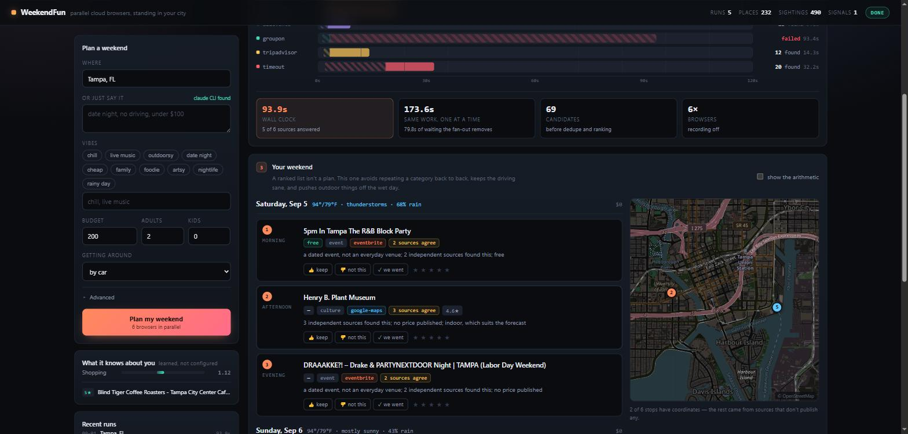

# WeekendFun

Twelve cloud browsers, in parallel, each one standing in your city, arguing about what you should do this weekend. Then it remembers what you actually liked.

Built on [Solari](https://getsolari.com).

```bash
npm install
cp .env.example .env      # add your SOLARI_API_KEY
npm run plan -- "Tampa, FL" -- --vibes "chill, live music" --budget 220
```

```
Launching 6 cloud browsers in parallel:
  ✓ google-maps   in position, verified (2.1s)
  ✓ groupon       in position, verified (2.4s)
  ● timeout        20 found (8.3s)
  ● groupon        27 found (11.7s)
  ● google-maps    34 found (21.6s)

129 candidates from 6/6 sources in 22.1s

Saturday, Sep 5  85°/78°F, thunderstorms, 61% rain
────────────────────────────────────────────────────────────────────
  Morning    The Florida Aquarium
             —        family
             3 independent sources found this; indoor, which suits the forecast

  Evening    Bob Ross Sip & Paint Night at Kava Culture Downtown Tampa
             free     event
             a dated event, not an everyday venue; free
```

## Why this needs cloud browsers

Google Maps, Groupon, Eventbrite and Yelp all answer "what's on this weekend" differently depending on **where the browser is**. That's the whole problem. You cannot `fetch()` your way to a local answer, and a scraping API gives you one location's view of the web.

So: one browser per source, all of them placed in your city, all at once. Six sources answer in the time the slowest one takes.

Run the proof yourself:

```bash
npm run geo-proof
```

It asks *"live music"* from two cities simultaneously and diffs the answers:

| | Tampa browser | Seattle browser |
|---|---|---|
| | 1920 Ybor | Neumos |
| | The Sapphire Tampa | The Crocodile |
| | Chewy's Lounge | Dimitriou's Jazz Alley |

**0% overlap.** Both egressed from the same residential IP pool in North Carolina.

### The part that surprised me

The obvious way to do this is Solari's proxy geo-narrowing — `proxy: { country: "us", state: "florida", city: "tampa" }`. Measured on a Starter plan, **that narrowing is inert**: `seattle` and `tampa` both egress from AT&T North Carolina, and the gateway's confirmation object only ever echoes back `{ timezoneId, country, tier }`.

What works instead is telling the *page* where it is rather than hoping the *packet* implies it — explicit coordinates in the URL, plus a Playwright context with `geolocation`, matching `timezoneId`, and `locale`. It's deterministic, works for any city on earth, and doesn't depend on what's in the proxy pool.

The residential proxy still earns its place. It's what gets past Groupon's datacenter block. It just isn't how you localize.

## Nothing searches until the browser proves where it is

A context whose geolocation override silently failed still scrapes perfectly — it just returns results for wherever the egress IP happens to be. Those look completely valid, get ranked, and land in the learning store as if they were your city.

So it's a hard precondition. The pool opens the context, asks the page where it thinks it is, and compares:

```
geolocation override did not take for Tampa, FL:
  asked for 27.9475,-82.4584 but page reports 35.7796,-78.6382
```

A source physically cannot run against an unverified browser, because it never receives one. Keywords are planned before any browser launches, too — deciding what to search while holding twelve sessions open wastes the expensive thing to save the cheap one.

## The six sources answer different questions

| Source | What it's for |
|---|---|
| **Google Maps** | venues + **coordinates** — the only source with real geometry, which is what makes travel time possible |
| **Eventbrite** | dated, ticketed events |
| **AllEvents** | dated events, long tail, and small cities where Eventbrite is empty |
| **Groupon** | what is *discounted right now* — finds things you can suddenly afford |
| **TripAdvisor** | consensus ranking, for corroboration |
| **Time Out** | local editorial voice — the *why*, in a sentence worth quoting |
| **Weather** | a **constraint**, not a candidate (Open-Meteo, keyless) |
| **Reddit** | optional, official API — see below |

**Corroboration is the payoff.** Three independent sources finding The Florida Aquarium means far more than any one of them ranking it first, and it's the one signal a parallel fan-out computes that a single scraper cannot.

### Reddit

Reddit blocks all logged-out automation. Measured: 403 across residential proxy, datacenter egress, stealth, managed captcha solving, Cloudflare Web Bot Auth, and the `.json` endpoint. Its own block page names the two supported routes — log in, or use a developer token.

This uses the token. Automating a logged-in personal account would violate their ToS and risk the account, which is a bad trade for a public repo. Add `REDDIT_CLIENT_ID` / `REDDIT_CLIENT_SECRET` ([create a `script` app](https://www.reddit.com/prefs/apps)) and it turns on. Without them the source skips itself and everything else runs.

## It works outside the city it was written in

Every scraper here was written against Tampa, and a scraper that works in
exactly one city is a demo. `npm run harden` runs the real fan-out across a
spread of places and prints a yield matrix:

```
city                google-maps   eventbrite    allevents     groupon       tripadvisor   timeout
Austin, TX          38            9             15            15            14            40
Boise, ID           37            10            15            18            12            25
Seattle, WA         38            9             15            28            12            30
Asheville, NC       38            9             15            9             12            31

No source failed outright.
```

It runs with `retries: 0` on purpose — retries hide flakiness, and the point is
to see it. Two real problems surfaced this way and neither was visible in Tampa:

- **TripAdvisor blew its watchdog in about half of runs**, but finished in 11-14s
  when run alone. The work hadn't got slower; six browsers launching at once had.
  Launches are now staggered a few hundred milliseconds apart.
- **One flaky source was setting the wall clock for the whole plan.** The fan-out
  is parallel, so it finishes with the slowest source — a failing TripAdvisor on
  the default 90s budget turned a 20s Boise plan into 98s. Sources can now
  declare their own budget, and TripAdvisor gets 45s: it is the most
  contention-sensitive and the least essential, so it should fail fast.

Boise went from 5/6 sources in 98s to 6/6 in 20s.

## The dashboard

```bash
npm run dashboard        # http://localhost:5173
```



Everything the CLI does, plus the three things that are much easier to see than
to read:

- **The fan-out on one clock.** A lane per browser on a shared time axis. The
  striped head of each bar is the browser getting into position — launching,
  then passing the geolocation gate — and the solid remainder is the source
  actually reading a site. Staggered launches, a slow source's long tail and a
  blown watchdog are all legible at a glance, next to the honest version of the
  parallelism claim: this run's wall clock against the sum of the same work
  done one source at a time.
- **The plan as a map.** The stops in order, joined by the route, day two in
  blue. It says how many stops have coordinates, because only Google Maps
  publishes any and pretending otherwise would be a lie about the data.
- **The replay.** Tick *record sessions* and every result gets a ▶ that plays
  back the rrweb recording of the browser that found it — including the
  geo-pinned URL it navigated to. That is the whole geolocation argument, on
  video, from the session itself.

Thumbs and stars write to the same SQLite store `npm run feedback` does, and
the taste bars redraw as the weights move. "N sources agree" opens the evidence:
one row per source with the text it actually returned.

It's a `node:http` server, server-sent events, and one page of hand-written
HTML — no framework, no bundler, no new dependency. `npm run dashboard` starts
instantly and the repo still installs from two packages.

It binds to `127.0.0.1` on purpose. It holds your API key, writes to your local
store, and can spend money on your Solari account, and it has no auth: it's a
control panel, not a deployable app.

## Ranking is deterministic and shows its working

No model decides what goes in your weekend. Every score is named components you can read:

```bash
npm run plan -- "Tampa, FL" -- --explain
```

```
  Afternoon  Henry B. Plant Museum
             +28.0 corroboration: 3 independent sources found this
              +7.3 rating: 4.6★ from 1,428 reviews
              +6.2 well known: 1,428 people have reviewed it
              +5.0 indoor bonus: indoor, which suits the forecast
              -5.0 price unknown: no price published
```

`--explain` isn't a reconstruction after the fact. It's the arithmetic that produced the ordering.

The itinerary builder then does what a ranked list can't: no two adjacent slots from the same category, geography-aware hops, outdoor things demoted on wet days, one source never owning every slot, and a running budget total.

## It learns

```bash
npm run feedback -- 394495 rated 5     # loved it
npm run feedback -- d53985 did         # actually went
npm run feedback -- e6c868 rated 1     # never again
```

```
Relearned from 4 signal(s).
  leans toward: event (1.24)
  leans away from: culture (0.88), family (0.88)
```

Next run, the museum is gone and the paint night is in the first slot.

The taste vector is a handful of numbers in SQLite that you can print (`npm run history`). Weights are clamped to `[0.4, 1.8]` and only ever *scale* the base components, so a cold start degrades to a sensible generic ranker rather than to noise, and two clicks can't invert your results. It's a full recompute from signal history, not an incremental nudge — so deleting a bad signal actually undoes it.

## Commands

```bash
npm run plan -- "Seattle, WA" -- --vibes "outdoorsy, cheap" --budget 150
npm run plan -- "Austin, TX" -- --ask "date night, no driving, under $100"
npm run plan -- "Tampa, FL" -- --explain --record
npm run dashboard                     the browser UI: live fan-out, map, replays
npm run feedback -- <candidate-id> <kept|skipped|did|rated> [1-5]
npm run history
npm run sources
npm run geo-proof                     prove the location targeting works
npm run harden                        run every source against several cities
npm run harden -- "Boise, ID"         ...or ones you choose
```

Flags: `--vibes --budget --adults --kids --mobility --avoid --days --sources --concurrency --retries --explain --record --no-writeup`

**Note the second `--` before any flag.** npm parses the first batch after
`--` as its own config and drops the flag names, so a single dash quietly
runs with defaults. The CLI detects that and tells you. Without npm in the
way one dash is enough: `npx tsx src/cli.ts plan "Tampa, FL" --explain`.

## Claude is optional, and only at the edges

`--ask` parses a free-text request, and a write-up turns the finished plan into prose. Both shell out to the `claude` CLI in headless mode, which works on a Pro/Max subscription **with no API key** — so cloning this needs exactly one secret.

Ranking, itinerary assembly and learning are all deterministic code. An LLM in the ranking path would make results unreproducible and learning unmeasurable. If `claude` isn't installed, you lose prose and keep the plan.

## Six things that cost an afternoon

Kept here because the Solari cookbook asks for exactly this, and each one produced a plausible-looking wrong answer rather than an error.

- **`waitForSelector` is not bounded by its own timeout.** With `{ timeout: 6_000 }` on a busy SPA it took **65 seconds** — its polling can't get scheduled on a saturated page. It ate the entire source budget while logging nothing. A bounded `waitForTimeout` plus a direct query is both faster and honest; `evaluateAll` on a missing selector returns `[]`, which is the right answer for "no events" anyway.
- **`waitUntil: "domcontentloaded"` never settles** on sites with a long resource tail. `"commit"` returns in ~1s, and a bounded wait afterwards is enough. 110s hang → 7s.
- **`closest("section")` can match the entire results container**, so `textContent` returns the whole document. Twenty of those through a greedy `[^•]*` regex wedges the page's JS thread.
- **The event dates were scraped, displayed, and then thrown away.** Every
  source set `windows: null` — Eventbrite under a comment claiming "the
  itinerary matches on day name", which it never did — and the timeliness
  bonus was awarded on `source === "eventbrite"` alone while its sentence
  read "a dated event, not an everyday venue". Measured over 206 stored
  listings, **83 of them were on a different date**, each collecting the same
  +16 as one on the actual Saturday, and nothing stopped a Saturday-night
  party being scheduled for Sunday. Dates are parsed now (`sources/when.ts`,
  100% of those 206), events off the weekend are scored `-45`, and the
  itinerary refuses to place a dated event on a day it is not happening.
- **`npm run x -- --flag value` does not pass the flag.** npm 11 parses what
  follows `--` as its own config: it records `--sources timeout` as a boolean
  config named `sources`, drops the flag name from argv, and leaves `timeout`
  behind as a stray positional. So `npm run plan -- "Tampa, FL" --sources
  timeout --budget 150` ran a full six-source plan on the default budget and
  reported nothing wrong. A second `--` fixes it. The values are unrecoverable
  by then (npm stored `true`, not `timeout`), but the leftover `npm_config_*`
  variables make the case exactly detectable, so the CLI now says so instead
  of quietly doing the wrong thing.
- **`toISOString()` shifts the date.** Building a local `Date`, adding days, then slicing the ISO string planned Sunday and Monday for a request made on a Monday in Florida. Do the arithmetic on Y/M/D integers via `Date.UTC`.

## Layout

```
src/
  place.ts            geocoding — disambiguates Tampa FL from Tampa KS
  solari/geo.ts       proxy + the geolocation gate (and why pinning is dead)
  solari/pool.ts      concurrency-capped fan-out, per-source watchdogs
  engine/keywords.ts  what to search for, decided before any browser launches
  engine/score.ts     deterministic ranking with named components
  engine/itinerary.ts ranked list -> an actual schedule
  engine/learn.ts     signals -> taste vector
  store/db.ts         node:sqlite, no native modules
  sources/            one file per source
```

MIT.
